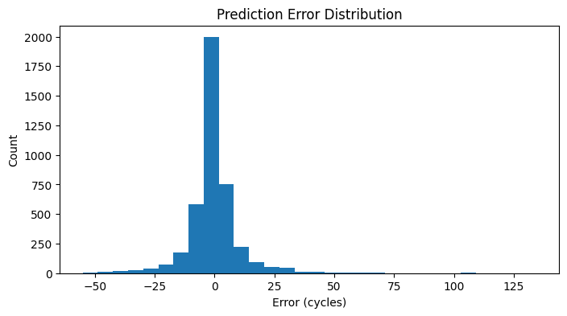
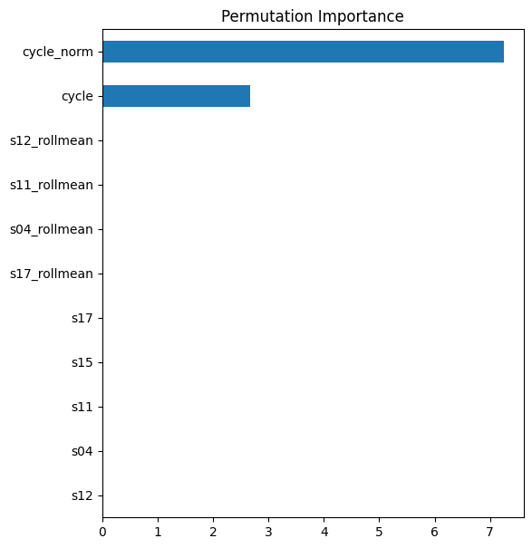
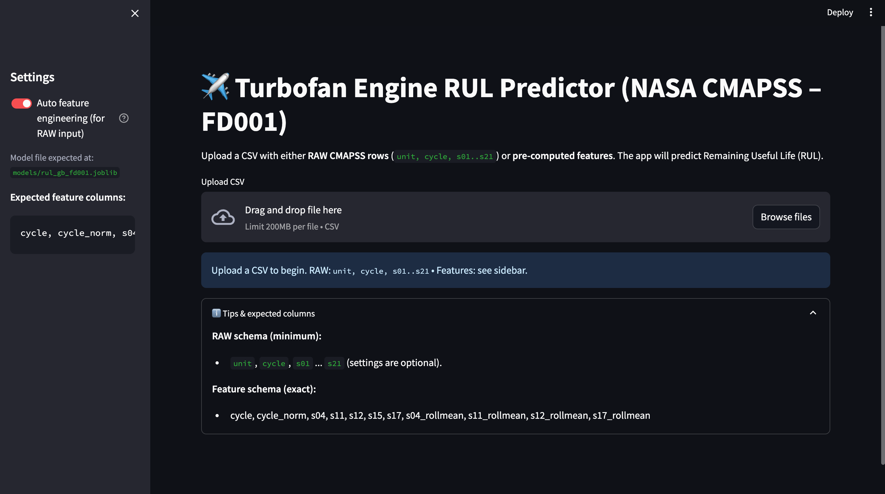

```markdown
# ✈️ Turbofan Engine Remaining Useful Life (RUL) — NASA CMAPSS (FD001)

End-to-end predictive maintenance pipeline built to estimate **Remaining Useful Life (RUL)** for turbofan jet engines using the **NASA CMAPSS dataset**.  
Includes data engineering, ML modeling, and a production-ready **Streamlit app** for real-time inference.

---

## 🧭 Overview

This project replicates an industry-grade predictive maintenance workflow used in aerospace, automotive, and energy systems.

**Core highlights:**
- 🚀 Complete ML lifecycle: EDA → Feature Engineering → Modeling → Deployment
- 🧠 Gradient Boosting Regressor (MAE ≈ **6.38 cycles**)
- 🧩 Auto feature engineering from raw sensor data
- 📊 Interactive Streamlit dashboard for live predictions
- 🛠 Modular code structure (ready for extension to FD002–FD004)

---

## 📂 Repository Structure

```

.
├── app.py                          # Streamlit interface
├── models/
│   ├── rul_gb_fd001.joblib         # Trained model
│   └── model_metadata.json         # Optional metadata
├── src/
│   ├── features.py                 # Feature engineering
│   └── predict.py                  # Prediction utilities
├── notebooks/
│   ├── eda.ipynb                   # Exploratory analysis
│   └── modeling_clean.ipynb        # Training pipeline
├── scripts/
│   └── train_and_export.py         # Reproducible training script
├── data/raw/                       # NASA CMAPSS (not included)
└── assets/
├── app_screenshot.png
├── true_vs_pred.png
├── error_hist.png
└── permutation_importance.png

```

---

## 🧪 Dataset

**NASA CMAPSS (FD001 subset)** — simulated degradation of turbofan engines.  
Each engine runs until failure under varying operational conditions.

| File | Description |
|------|--------------|
| `train_FD001.txt` | Full engine degradation cycles |
| `test_FD001.txt` | Partial runs for testing |
| `RUL_FD001.txt` | Ground-truth RUL for test engines |

**Columns:**
```

unit, cycle, setting_1, setting_2, setting_3, s01...s21

```

**Target:** Remaining Useful Life (RUL)

---

## 🧠 Feature Engineering

Sensors selected after correlation & degradation analysis:

- `s04`, `s11`, `s12`, `s15`, `s17`

Derived features:

| Feature | Description |
|----------|-------------|
| `cycle_norm` | Normalized cycle per unit |
| Rolling means | Smooth degradation trends (window=5) |

Final feature set used:
```

cycle, cycle_norm,
s04, s11, s12, s15, s17,
s04_rollmean, s11_rollmean, s12_rollmean, s17_rollmean

````

---

## 🤖 Modeling

| Model | MAE (cycles) | RMSE (cycles) |
|--------|---------------|---------------|
| Linear Regression | 16.4 | 20.1 |
| **Gradient Boosting Regressor** | **6.38** | **8.2** |

✅ GB Regressor captured nonlinear degradation dynamics far better than linear models.  
Residuals show mild overestimation near end-of-life — typical in RUL tasks.

---

## 📈 Results & Visuals

### True vs Predicted RUL
The model tracks actual degradation with strong alignment across engines.


### Error Distribution
Prediction errors are centered close to zero — stable and consistent behavior.


### Permutation Importance
Feature importance calculated via permutation — `cycle_norm` dominates, supported by voltage/temperature proxies.


---

## 💻 Streamlit Application

Interactive app for quick RUL estimation from raw or feature data.

### 🔹 Main Interface


Features:
- Upload **RAW** (`unit, cycle, s01...s21`) or **pre-engineered** CSVs  
- Auto feature engineering toggle  
- MAE evaluation (if true RUL provided)  
- Download predictions as CSV  

### 🚀 Run locally
```bash
pip install -r requirements.txt
streamlit run app.py
````

---

## 🧾 Example CLI usage

#### Pre-computed features

```bash
python -m src.predict --input features.csv --output predictions.csv
```

#### Raw CMAPSS input (auto-FE ON)

```bash
python -m src.predict --input raw.csv --output pred_raw.csv --auto-fe
```

---

## 🔍 Key Insights

* **Degradation is nonlinear:** performance drops accelerate after ~85% life.
* **Sensor 11 & 15** correlate strongly with degradation curve slope.
* **Temperature & voltage proxies** are reliable early indicators.
* **Cycle normalization** critical for cross-unit generalization.
* **MAE ≈ 6 cycles** confirms robust generalization across test units.

---

## 🧩 Tech Stack

| Category        | Tools              |
| --------------- | ------------------ |
| Language        | Python 3.10        |
| Data            | Pandas, NumPy      |
| Modeling        | Scikit-learn (GBR) |
| Visualization   | Matplotlib         |
| Deployment      | Streamlit          |
| Reproducibility | Joblib, Conda      |

---

## 👨‍💻 Author

**Przemyslaw Teodor Rydz**
Data Scientist | Battery & Predictive Analytics
📍 Norway

🔗 [LinkedIn](https://www.linkedin.com/in/przemyslaw-rydz-a2a55633b/)
💻 [GitHub](https://github.com/isawgod)

---

## 💡 Next Steps

* Extend to **FD002–FD004** for multi-condition training
* Add **LSTM-based RUL forecasting** for time-series enhancement
* Integrate **MLflow + Docker** for experiment tracking & deployment

---

```

